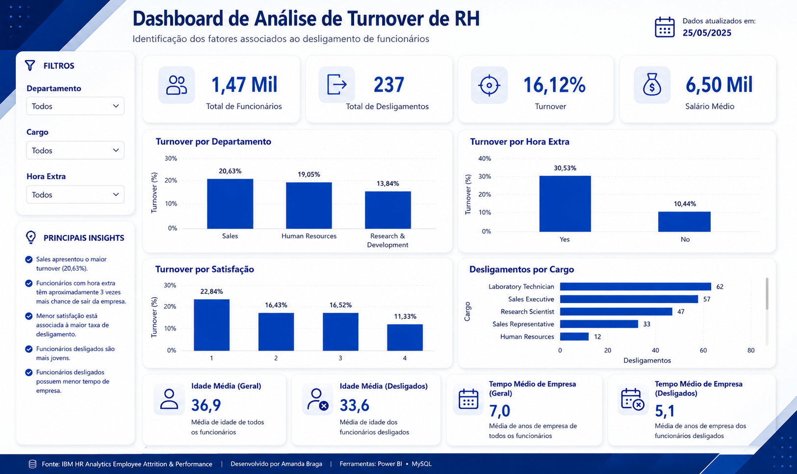

# Dashboard de Análise de Turnover de RH

## Objetivo

Este projeto tem como objetivo analisar os fatores relacionados ao desligamento de funcionários utilizando SQL, Power BI e DAX.

A análise foi desenvolvida com base no dataset IBM HR Analytics Employee Attrition & Performance.

## Ferramentas Utilizadas

* SQL (MySQL)
* Power BI
* DAX
* Excel

## Principais KPIs

* Total de Funcionários
* Total de Desligamentos
* Turnover %
* Salário Médio

## Principais Análises

* Turnover por Departamento
* Turnover por Hora Extra
* Turnover por Satisfação
* Desligamentos por Cargo
* Perfil dos Funcionários Desligados

## Principais Insights

* Sales apresentou o maior turnover (20,63%).
* Funcionários com hora extra possuem aproximadamente 3 vezes mais chance de desligamento.
* Menor satisfação está associada a maiores taxas de turnover.
* Funcionários desligados são mais jovens.
* Funcionários desligados possuem menor tempo de empresa.

## Autor

Amanda Braga

Power BI | SQL | Data Analytics
